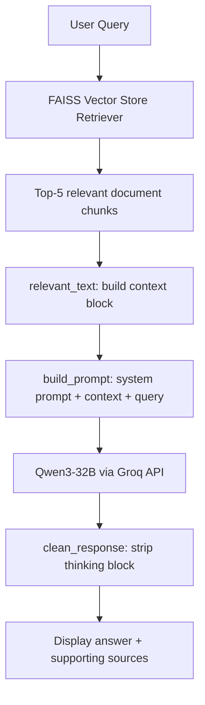
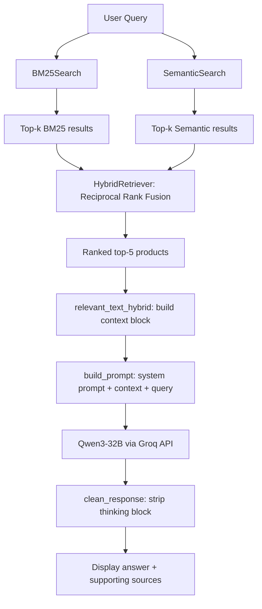

# DSCI 575 Project: Amazon Product Search Assistant

Authors: Christine Chow and Ian Gault

GitHub Repository: [UBC-MDS/DSCI_575_project_gaultian_chrchow](https://github.com/UBC-MDS/DSCI_575_project_gaultian_chrchow)

### Project Goal

This project builds a context-aware product search assistant using the Amazon Reviews 2023 dataset. The app supports BM25 keyword search, semantic vector search, hybrid search, and retrieval-augmented generation (RAG) workflows including a hybrid RAG mode for grounded question answering over product metadata and review text.

### Dataset Description

For this project, we are using the Appliances category from the [Amazon Reviews 2023 dataset](https://amazon-reviews-2023.github.io) collected in 2023 by [McAuley Lab](https://cseweb.ucsd.edu/~jmcauley/). There are two different files available in this category: *User Reviews* containing reviews, star ratings, etc, and *Item Metadata* containing descriptions, price, and other features. The raw .json.gz files were loaded and merged together on `parent_asin` before undergoing text preprocessing (lowercasing and punctuation removal) to create a searchable corpus. Merging the files together would allow the retrieval system to match queries from both the product specifications and user reviews.

### Retrieval Workflows

Both BM25 and semantic search index the same set of metadata fields: `product_title`, `features`, `description`, `categories`, and `details`, so that comparisons between the two methods reflect differences in retrieval approach rather than differences in different corpuses.

BM25 search was performed using the [`rank_bm25`](https://pypi.org/project/rank-bm25/) package. Both the corpus and user queries are processed and tokenized before results are ranked based on a derivation of the TF-IDF (term frequency - inverse document frequency).

Semantic search was executed using the `all-MiniLM-L6-v2` transformer model from the [`sentence-transformers`](https://huggingface.co/sentence-transformers) to generate document embeddings. These embeddings were then indexed using [FAISS](https://faiss.ai/index.html) (Facebook AI Similarity Search) to enable similarity searches. Cosine similarity was used to calculate vector similarity and results are retrieved using k-nearest neighbours.

### Repository Structure

BM25, semantic retrieval, and RAG components are defined in `src/` and built through separate indexing scripts.

```text
DSCI_575_project_gaultian_chrchow/
├── app/
│   └── app.py
│      Streamlit application for BM25, semantic, and RAG-based product search.
│
├── data/
│   ├── raw/
│   │   Original input data files.
│   └── processed/
│       Processed data and saved retrieval indexes used by the app.
│
├── src/
│   ├── bm25.py
│   │   BM25 retrieval class, including index building, searching, saving, and loading.
│   ├── semantic.py
│   │   Semantic retrieval class using SentenceTransformers and FAISS.
│   ├── build_index.py
│   │   Script to build and save BM25 and semantic search indexes from the processed dataset.
│   ├── rag_pipeline.py
│   │   RAG retrieval, prompt-building, and answer-generation helpers.
│   ├── hybrid.py
│   │   Hybrid retriever class combining BM25 and semantic search using Reciprocal Rank Fusion (RRF).
│   ├── build_rag.py
│   │   Script to build and save the FAISS index used by the RAG pipeline.
│   ├── prompts.py
│   │   Prompt template helpers for the RAG answer generation step.
│   └── utils.py
│       Utility helpers used by retrieval:
│       - `text_preprocessor`: tokenization, stopword removal, and stemming for BM25
│       - `normalize`: converts strings, lists, and dicts into plain text
│       - `build_documents`: combines selected columns into one searchable document per row
│
├── notebooks/
│   Project notebooks for EDA, preprocessing, and experimentation.
│
├── requirements.txt
│   Python package requirements.
│
├── environment.yml
│   Conda environment specification for reproducing the project setup.
│
├── README.md
│   Project overview, setup instructions, and usage documentation.
│
└── Makefile
    Convenience commands for environment setup, index building, app launch, and cleanup.
```

### LLM Model

We use `Qwen3-32B` via the [Groq API](https://console.groq.com/) as the LLM for both RAG pipelines. Qwen3 is an open-source large language model from Alibaba Cloud that generates clear, grounded answers when given retrieved product context. We picked the 32B size over smaller variants for better answer quality, and Groq's free API is fast enough for interactive use without requiring local GPU.

### RAG Workflows

#### Semantic RAG

Semantic RAG uses a FAISS vector store built from chunked product documents to find the most relevant results for a query. The retrieved chunks are built into a context block and passed to the LLM to generate an answer.



#### Hybrid RAG

Hybrid RAG combines BM25 and semantic search results using Reciprocal Rank Fusion (RRF) into a single ranked list of products. The top ranked products are built into a context block and passed to the LLM to generate an answer.



### Web App Features

To interact with the information retrieval systems, we developed a simple web app using Streamlit. Features include:

* Search Mode Selection: Users can toggle between BM25, Semantic, Hybrid, RAG and Hybrid RAG search modes

* User Query Input: A natural language text box for querying

* Detailed Search Results: For each retrieved product, the app displays the product title, a truncated review, the star rating, and the retrieval score for BM25 or Semantic search

* RAG Answer Panel: In RAG mode and Hybrid RAG modes, the app generates a grounded answer and shows supporting product cards plus the retrieved chunk text used as evidence

### Installation and Setup

 **Note**: For a summary of makefile actions:

```bash
make help
```

1.  **Clone the repository** After opening a terminal, clone the repository and navigate to the project directory:

    ```bash
    git clone https://github.com/UBC-MDS/DSCI_575_project_gaultian_chrchow.git
    cd DSCI_575_project_gaultian_chrchow
    ```

2.  **Environment Setup**

    i. Create or Prune the Conda environment:

        ```bash
        make create
        make prune
        ```

    ii. Activate the Conda environment:

        ```bash
        conda activate 575_proj
        ```

3.  **Environment Variables** Create an `.env` file in root directory. Note: Do not commit this file to Github!

    ```bash
    GROQ_API_KEY=<your_groq_api_key>
    ```

4. **Data Preparation and Indexing** To reproduce our results:

    1. **Import and Pre-Processing** . Note: Do not commit this file to Github!

        a. Import the the raw meta data and review data from <https://mcauleylab.ucsd.edu/public_datasets/data/amazon_2023/raw>
        
        b. Merge datasets
        
        c. Pre-processing of text data
        
        d. Save as `processed.parquet`

        To balance processing time with meaningful information retrievals, we chose to load 20k metadata products and 200k reviews.

        ```bash
        make process
        ```

    2. **EDA** Option step. Internal data exploration to inform analysis

        a. Run all cells in `notebooks/milestone1_exploration.ipynb` to process raw data into `data/processed/merged.parquet`. (Part of Milestone 1)

        b. Run all cells in `notebooks/milestone2_exploration.ipynb` to explore `data/processed/processed.parquet` and confirm pre-processing steps taken in `import_process.py`. (Improvements made in Milestone 2)

    3.  **Build IR indexes:** run the indexing script to build BM25 and Semantic search indices:

        Derived from `data/processed/processed.parquet`.

        Due to the large file sizes, processed indexing artifacts are ignored by git, so `make build-ir` is an essential step to run BM25 and Semantic search in the app.

        ```bash
        make build-ir
        ```

    4.  **Build RAG index:** run the RAG indexing script to build the persisted FAISS chunk index used by the RAG mode:

        Also derived from `data/processed/processed.parquet`.

        `make build-rag` is required before using RAG mode in the app.

        ```bash
        make build-rag
        ```

5.  **Running the Web App** Launch the Streamlit dashboard:

    ```bash
    make run
    ```

    Once finished using the app, close the window in the browser, and in terminal press `cntl + c` to stop running the app.

6. **Remove index data** in `data/processed/`:

    If wanting to confirm a clean state of index files, or reduce memory, before closing up the project.

    ``` bash
    make clean
    ```

To run the full pipeline of `make clean`, `make process`, `make build-ir`, `make build-rag`, and `make run`:

``` bash
make all
```
