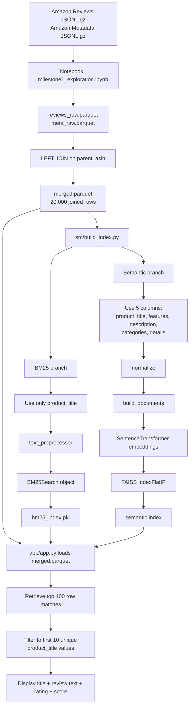

# Milestone 1 Pipeline: Flow and Questions

**For internal use, not for submission**

This note maps the current repo flow so you can explain it clearly to a prof or TA and ask targeted questions about where to improve it.

## 1. End-to-end flow

## 2. What each file does

- `notebooks/milestone1_exploration.ipynb`
  Builds `reviews_raw.parquet`, `meta_raw.parquet`, then joins them into `merged.parquet` on `parent_asin`.
- `src/utils.py`
  Holds all helper functions currently used by retrieval.
- `src/utils.py:text_preprocessor`
  Used only by BM25. Lowercases, splits, strips punctuation, removes stopwords, and stems.
- `src/utils.py:normalize`
  Used only by semantic search. Flattens strings, lists, and dicts into one text string.
- `src/utils.py:build_documents`
  Used only by semantic search. Combines selected columns into one document per row.
- `src/bm25.py`
  Defines `BM25Search`: build index, retrieve, save, load.
- `src/semantic.py`
  Defines `SemanticSearch`: build documents, embed them, create FAISS index, retrieve, save, load.
- `src/build_index.py`
  Main build script that reads `merged.parquet` and saves the two retrieval artifacts.
- `app/app.py`
  Loads the dataframe and both saved retrieval artifacts, runs search, filters duplicate titles for display.

## 3. Important current behavior

### Join and duplicates

- The join is at the review-row level, not the unique-product level.
- `merged.parquet` keeps review fields like `text` and `rating`, and also adds metadata fields like `product_title`, `features`, `description`, `categories`, and `details`.
- Because multiple reviews can point to the same `parent_asin`, metadata is repeated across many rows.
- That means retrieval is currently indexing rows, not unique products.

### BM25 input and output

- BM25 uses only `product_title`.
- Saved output is `bm25_index.pkl`.
- That `.pkl` file stores the whole Python `BM25Search` object, including the original title list, tokenized corpus, and fitted `BM25Okapi` model.

### Semantic input and output

- Semantic search uses 5 columns:
  `product_title`, `features`, `description`, `categories`, `details`
- Each row becomes one combined document after `normalize` and `build_documents`.
- Saved output is `semantic.index`.
- That `.index` file stores only the FAISS vector index.
- It does not save the dataframe row contents inside the index file.

### Why `.pkl` vs `.index` are different

- `.pkl` is a Python pickle of a full object.
- `.index` is a FAISS-native binary index file for vector search.
- BM25 reloads a full Python object.
- Semantic reloads only the FAISS index plus a fresh transformer model.

## 4. How retrieval works in the app

- The app loads `merged.parquet` separately into `df`.
- It also loads:
  - `bm25_index.pkl`
  - `semantic.index`
- Both retrieval methods return `(row_index, score)`.
- The app uses `df.iloc[index]` to recover the row data for presentation.
- It first asks for `top_k=100` row matches.
- Then it loops through those rows and keeps only the first 10 unique `product_title` values.

So the duplicate handling is currently:

- retrieve many row-level matches
- filter repeated titles only at display time

This is why duplicate products can appear inside the raw top 100 candidates even though only 10 unique titles are shown.

## 5. Where display information comes from

Displayed fields are pulled from `merged.parquet`, not from the saved indexes:

- title: `product_title`
- review snippet: `text`
- rating: `rating`
- score: returned by BM25 or semantic retrieval

This means the indexes tell the app which row to show, but the visible product/review content comes from the dataframe.

## 6. Questions

1. Should retrieval be row-level or product-level?
   Right now repeated reviews for the same product can occupy many of the top 100 results.

2. Should we deduplicate before indexing?
   Options are one row per `parent_asin`, one row per `product_title`, or keep row-level indexing and deduplicate only after retrieval.

3. For BM25, should we still use only `product_title`?
   This is much narrower than semantic search, which uses multiple metadata columns.

4. For semantic search, should review text also be included in the document?
   The current semantic document ignores `text` even though the app shows review text in results. Or are we feeding it junk?

5. Is filtering to 10 unique `product_title` values the right deduplication rule?
   `parent_asin` may be a more stable product identifier than title text. What if lots of reviews of 1 product?

6. Should the semantic build save extra metadata alongside the FAISS index?
   Right now the app depends on dataframe row order matching the order used when the index was built.

> **Varada’s suggested artifact structure**
>
> `data/processed/products.parquet`  
> One row per product/document, including text and metadata.
>
> `artifacts/faiss_index.bin`  
> FAISS index over embeddings.
>
> `artifacts/doc_ids.npy`  
> Maps FAISS row positions to document IDs or dataframe row indices.  
> A `.npy` file is NumPy’s binary format for storing arrays efficiently.
>
> `artifacts/config.json`  
> Stores the embedding model and how the document text was constructed.

7. Should we unify the BM25 and semantic document definitions?
   At the moment BM25 and semantic are searching different corpora, which makes comparison less clean.

## 8. Summary

We start with review data and metadata, join them on `parent_asin`, and save the joined table as `merged.parquet`. From that file, BM25 indexes only `product_title`, while semantic search combines five metadata columns into one document per row and stores a FAISS vector index. In the app, both methods return row indices, then the app looks those rows up in `merged.parquet`, removes repeated titles from the top 100 candidates, and shows the first 10 unique products with review text, rating, and score.
