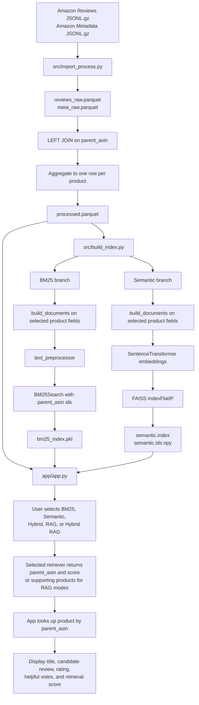

# Current Retrieval Pipeline Flow

## End-to-end flow

## Summary

The updated pipeline is product-level rather than review-row-level. `src/import_process.py` joins raw review and metadata files, aggregates them to one row per `parent_asin`, and saves `processed.parquet`. `src/build_index.py` then builds both BM25 and semantic retrieval artifacts from that same processed product table, keeping `parent_asin` aligned to each searchable document.

In the app, the retrieval modes return stable product IDs instead of row positions. `app.py` uses `parent_asin` to look up the product in `processed.parquet` and display the product title, candidate review snippet, rating summary, helpful votes, and retrieval score. The current app also includes Hybrid, RAG, and Hybrid RAG modes, though this diagram remains focused on the shared processed-data and retrieval-index flow.
